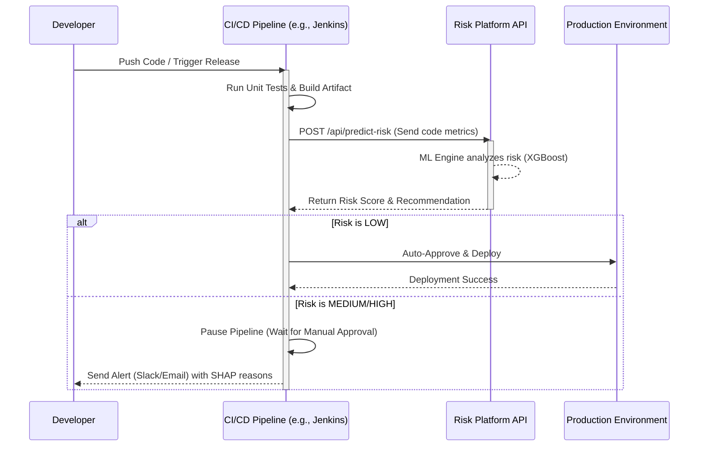

# CI/CD Integration: AI-Based Deployment Risk Prediction Platform

## 1. Overview & Workflow

The platform acts as an automated, AI-driven gatekeeper in any continuous integration and deployment pipeline. Before a code artifact is promoted to a production environment, the pipeline synchronously queries the Risk Platform API. 

### 1.1 CI/CD Workflow Diagram


---

## 2. API Integration Logic

Regardless of the CI tool, the integration generally relies on a simple cURL script or a custom action/plugin that performs the following:

1. **Extract Metrics**: Gathers lines changed, files modified, and commit history from the VCS.
2. **Send Request**:
   ```bash
   RESPONSE=$(curl -s -X POST "https://risk-api.company.com/api/predict-risk" \
     -H "Authorization: Bearer $RISK_PLATFORM_TOKEN" \
     -H "Content-Type: application/json" \
     -d '{
       "files_changed": 12,
       "lines_added": 300,
       "lines_deleted": 45,
       "author": "jane_doe"
     }')
   
   RISK_LEVEL=$(echo $RESPONSE | jq -r '.risk_level')
   RECOMMENDATION=$(echo $RESPONSE | jq -r '.recommendation')
   ```
3. **Evaluate**: If `$RISK_LEVEL` == "High Risk", exit with a non-zero code (`exit 1`) to block the pipeline.

---

## 3. Pipeline Configuration Examples

### 3.1 GitHub Actions (`.github/workflows/deploy.yml`)
GitHub Actions uses an intermediate bash script to query the API and fail the action if the risk is too high.

```yaml
name: Production Deployment
on:
  push:
    branches: [ main ]

jobs:
  risk_analysis:
    runs-on: ubuntu-latest
    steps:
      - name: Checkout code
        uses: actions/checkout@v3
        with:
          fetch-depth: 0 # Required to get git diff

      - name: Calculate Code Metrics
        id: metrics
        run: |
          echo "files=$(git diff --name-only HEAD~1 HEAD | wc -l)" >> $GITHUB_OUTPUT
          echo "added=$(git diff --shortstat HEAD~1 HEAD | awk '{print $4}')" >> $GITHUB_OUTPUT
          
      - name: Query AI Risk Platform
        env:
          RISK_TOKEN: ${{ secrets.RISK_PLATFORM_TOKEN }}
        run: |
          RESPONSE=$(curl -s -X POST "https://risk-api.company.com/api/predict-risk" \
            -H "Authorization: Bearer $RISK_TOKEN" \
            -H "Content-Type: application/json" \
            -d "{\"files_changed\": ${{ steps.metrics.outputs.files }}, \"lines_added\": ${{ steps.metrics.outputs.added }}, \"lines_deleted\": 0, \"author\": \"${{ github.actor }}\"}")
          
          RISK_LEVEL=$(echo $RESPONSE | jq -r '.risk_level')
          echo "AI Risk Assessment: $RISK_LEVEL"
          
          if [ "$RISK_LEVEL" == "High Risk" ]; then
            echo "::error::Deployment blocked by AI. High Risk Detected."
            exit 1
          fi

  deploy:
    needs: risk_analysis
    runs-on: ubuntu-latest
    steps:
      - name: Deploy to Production
        run: echo "Deploying artifact..."
```

### 3.2 GitLab CI/CD (`.gitlab-ci.yml`)
GitLab pipeline blocks the `deploy` stage if the `risk-gate` job fails.

```yaml
stages:
  - build
  - risk-gate
  - deploy

risk-gate:
  stage: risk-gate
  image: alpine/curl
  script:
    - apk add jq git
    - FILES_CHANGED=$(git diff --name-only HEAD~1 HEAD | wc -l)
    - LINES_ADDED=$(git diff --shortstat HEAD~1 HEAD | awk '{print $4}')
    - |
      RESPONSE=$(curl -s -X POST "https://risk-api.company.com/api/predict-risk" \
        -H "Authorization: Bearer $RISK_PLATFORM_TOKEN" \
        -H "Content-Type: application/json" \
        -d "{\"files_changed\": $FILES_CHANGED, \"lines_added\": $LINES_ADDED, \"lines_deleted\": 0, \"author\": \"$GITLAB_USER_LOGIN\"}")
    - RISK_LEVEL=$(echo $RESPONSE | jq -r '.risk_level')
    - echo "Risk Level Evaluated: $RISK_LEVEL"
    - |
      if [ "$RISK_LEVEL" == "High Risk" ]; then
        echo "High risk deployment. Sending Slack alert..."
        curl -X POST -H 'Content-type: application/json' --data '{"text":"🚨 High Risk Deployment Blocked for '"$CI_PROJECT_NAME"'"}' $SLACK_WEBHOOK_URL
        exit 1
      fi
  only:
    - main

deploy-prod:
  stage: deploy
  script:
    - echo "Deploying to production (Auto-Approved by AI)..."
  needs: ["risk-gate"]
```

### 3.3 Azure DevOps (`azure-pipelines.yml`)
Azure DevOps can utilize a PowerShell script to invoke the REST API and control pipeline flow.

```yaml
trigger:
- main

pool:
  vmImage: 'ubuntu-latest'

stages:
- stage: RiskAssessment
  jobs:
  - job: AnalyzeRisk
    steps:
    - task: PowerShell@2
      inputs:
        targetType: 'inline'
        script: |
          $body = @{
              files_changed = 5
              lines_added = 120
              lines_deleted = 10
              author = "$(Build.RequestedFor)"
          } | ConvertTo-Json
          
          $response = Invoke-RestMethod -Uri "https://risk-api.company.com/api/predict-risk" -Method Post -Body $body -ContentType "application/json" -Headers @{Authorization="Bearer $(RiskToken)"}
          
          Write-Host "AI Risk Score: $($response.risk_score)"
          Write-Host "Risk Level: $($response.risk_level)"
          
          if ($response.risk_level -eq "High Risk") {
              Write-Error "Deployment blocked. ML Model predicts high likelihood of outage."
              exit 1
          } else {
              Write-Host "Risk is low. Auto-approving deployment."
          }

- stage: Deploy
  dependsOn: RiskAssessment
  condition: succeeded()
  jobs:
  - job: DeployJob
    steps:
    - script: echo "Deploying to Azure App Service..."
```

### 3.4 Jenkins Integration Note
In a `Jenkinsfile` (Declarative Pipeline), the integration follows the same curl/jq pattern placed within a `stage('AI Risk Gate')`. If `sh returnStatus: true` evaluates to a non-zero exit code due to high risk, Jenkins will mark the build as `FAILED` and use a `post { failure { slackSend(...) } }` block to alert the team.
