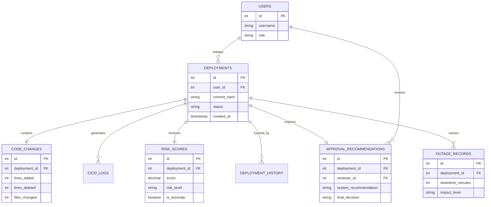

# Database Design: AI-Based Deployment Risk Prediction Platform

## 1. ER Diagram & Explanation

The database schema is highly normalized (3NF) to ensure data integrity across the deployment lifecycle. The core of the system revolves around the `deployments` table, which acts as the central hub.

- **Users**: Stores platform accounts (DevOps, Admins) for authentication and RBAC.
- **Deployments**: The central entity representing a unique deployment attempt linked to a specific commit hash.
- **Code Changes**: A 1-to-1 relationship with `deployments`, capturing the granular git diff metrics (lines added/deleted, complexity).
- **CI/CD Logs**: A 1-to-Many relationship with `deployments`, storing the raw logs and pipeline statuses for each deployment step.
- **Risk Scores**: A 1-to-1 relationship with `deployments`, storing the output of the ML Engine (score, anomaly flag).
- **Approval Recommendations**: A 1-to-1 relationship with `deployments` (often derived from the Risk Score), tracking the system's suggestion and the human's final override decision.
- **Deployment History**: An audit trail (1-to-Many) tracking state changes of a deployment (e.g., Pending -> Blocked -> Manually Approved).
- **Outage Records**: A 1-to-Many relationship with `deployments`, linking a specific deployment to a recorded production incident if it caused a failure.



---

## 2. SQL Schema (PostgreSQL)

```sql
-- 1. Users Table
CREATE TABLE users (
    id SERIAL PRIMARY KEY,
    username VARCHAR(100) UNIQUE NOT NULL,
    email VARCHAR(255) UNIQUE NOT NULL,
    hashed_password VARCHAR(255) NOT NULL,
    role VARCHAR(50) DEFAULT 'Developer',
    created_at TIMESTAMP DEFAULT CURRENT_TIMESTAMP
);

-- 2. Deployments Table
CREATE TABLE deployments (
    id SERIAL PRIMARY KEY,
    user_id INT REFERENCES users(id) ON DELETE SET NULL,
    commit_hash VARCHAR(40) UNIQUE NOT NULL,
    repository VARCHAR(255) NOT NULL,
    environment VARCHAR(50) NOT NULL,
    status VARCHAR(50) DEFAULT 'pending',
    created_at TIMESTAMP DEFAULT CURRENT_TIMESTAMP
);

-- 3. Code Changes Table
CREATE TABLE code_changes (
    id SERIAL PRIMARY KEY,
    deployment_id INT UNIQUE REFERENCES deployments(id) ON DELETE CASCADE,
    lines_added INT NOT NULL,
    lines_deleted INT NOT NULL,
    files_changed INT NOT NULL,
    code_complexity DECIMAL(5,2)
);

-- 4. Risk Scores Table
CREATE TABLE risk_scores (
    id SERIAL PRIMARY KEY,
    deployment_id INT UNIQUE REFERENCES deployments(id) ON DELETE CASCADE,
    score DECIMAL(5,2) NOT NULL,
    risk_level VARCHAR(20) NOT NULL, -- Low, Medium, High
    is_anomaly BOOLEAN DEFAULT FALSE,
    shap_reasoning TEXT,
    created_at TIMESTAMP DEFAULT CURRENT_TIMESTAMP
);

-- 5. Approval Recommendations Table
CREATE TABLE approval_recommendations (
    id SERIAL PRIMARY KEY,
    deployment_id INT UNIQUE REFERENCES deployments(id) ON DELETE CASCADE,
    reviewer_id INT REFERENCES users(id) ON DELETE SET NULL,
    system_recommendation VARCHAR(100) NOT NULL,
    final_decision VARCHAR(50), -- Approved, Rejected
    justification TEXT,
    created_at TIMESTAMP DEFAULT CURRENT_TIMESTAMP
);

-- 6. Deployment History (Audit Trail)
CREATE TABLE deployment_history (
    id SERIAL PRIMARY KEY,
    deployment_id INT REFERENCES deployments(id) ON DELETE CASCADE,
    previous_status VARCHAR(50),
    new_status VARCHAR(50) NOT NULL,
    changed_by INT REFERENCES users(id) ON DELETE SET NULL,
    changed_at TIMESTAMP DEFAULT CURRENT_TIMESTAMP
);

-- 7. CI/CD Logs
CREATE TABLE cicd_logs (
    id SERIAL PRIMARY KEY,
    deployment_id INT REFERENCES deployments(id) ON DELETE CASCADE,
    pipeline_stage VARCHAR(100) NOT NULL,
    log_output TEXT,
    stage_status VARCHAR(50) NOT NULL,
    execution_time_ms INT,
    created_at TIMESTAMP DEFAULT CURRENT_TIMESTAMP
);

-- 8. Outage Records
CREATE TABLE outage_records (
    id SERIAL PRIMARY KEY,
    deployment_id INT REFERENCES deployments(id) ON DELETE CASCADE,
    incident_ticket VARCHAR(100),
    downtime_minutes INT NOT NULL,
    impact_level VARCHAR(50) NOT NULL, -- Sev1, Sev2, Sev3
    root_cause TEXT,
    resolved_at TIMESTAMP
);
```

---

## 3. Sample Records

```sql
-- Insert User
INSERT INTO users (username, email, hashed_password, role) 
VALUES ('devops_sarah', 'sarah@company.com', 'hashed_abc123', 'Release Manager');

-- Insert Deployment
INSERT INTO deployments (user_id, commit_hash, repository, environment, status) 
VALUES (1, 'a1b2c3d4e5f6', 'payment-service', 'production', 'flagged_high_risk');

-- Insert Code Change
INSERT INTO code_changes (deployment_id, lines_added, lines_deleted, files_changed, code_complexity)
VALUES (1, 1540, 20, 15, 8.5);

-- Insert Risk Score
INSERT INTO risk_scores (deployment_id, score, risk_level, is_anomaly, shap_reasoning)
VALUES (1, 89.5, 'High', TRUE, 'High risk due to 1540 lines added in core module by junior dev.');

-- Insert Outage Record (Historical reference)
INSERT INTO outage_records (deployment_id, incident_ticket, downtime_minutes, impact_level, root_cause)
VALUES (1, 'INC-9942', 45, 'Sev1', 'Memory leak in new billing logic.');
```

---

## 4. Sample Queries

### 4.1 Identify Developers with the Highest Deployment Risk Average
Used by management to identify teams needing architectural support.
```sql
SELECT 
    u.username, 
    COUNT(d.id) as total_deployments, 
    AVG(r.score) as avg_risk_score
FROM users u
JOIN deployments d ON u.id = d.user_id
JOIN risk_scores r ON d.id = r.deployment_id
GROUP BY u.username
HAVING COUNT(d.id) > 5
ORDER BY avg_risk_score DESC;
```

### 4.2 Find All Deployments that Caused Severity 1 Outages
Used to train the ML Model on historical failures.
```sql
SELECT 
    d.commit_hash, 
    c.lines_added, 
    c.files_changed, 
    o.downtime_minutes
FROM deployments d
JOIN code_changes c ON d.id = c.deployment_id
JOIN outage_records o ON d.id = o.deployment_id
WHERE o.impact_level = 'Sev1';
```

### 4.3 Audit Log of Manual Approvals for High-Risk Deployments
Used for compliance to ensure managers are justifying their overrides.
```sql
SELECT 
    d.commit_hash, 
    r.score, 
    u.username as approved_by, 
    a.justification
FROM deployments d
JOIN risk_scores r ON d.id = r.deployment_id
JOIN approval_recommendations a ON d.id = a.deployment_id
JOIN users u ON a.reviewer_id = u.id
WHERE r.risk_level = 'High' AND a.final_decision = 'Approved';
```
