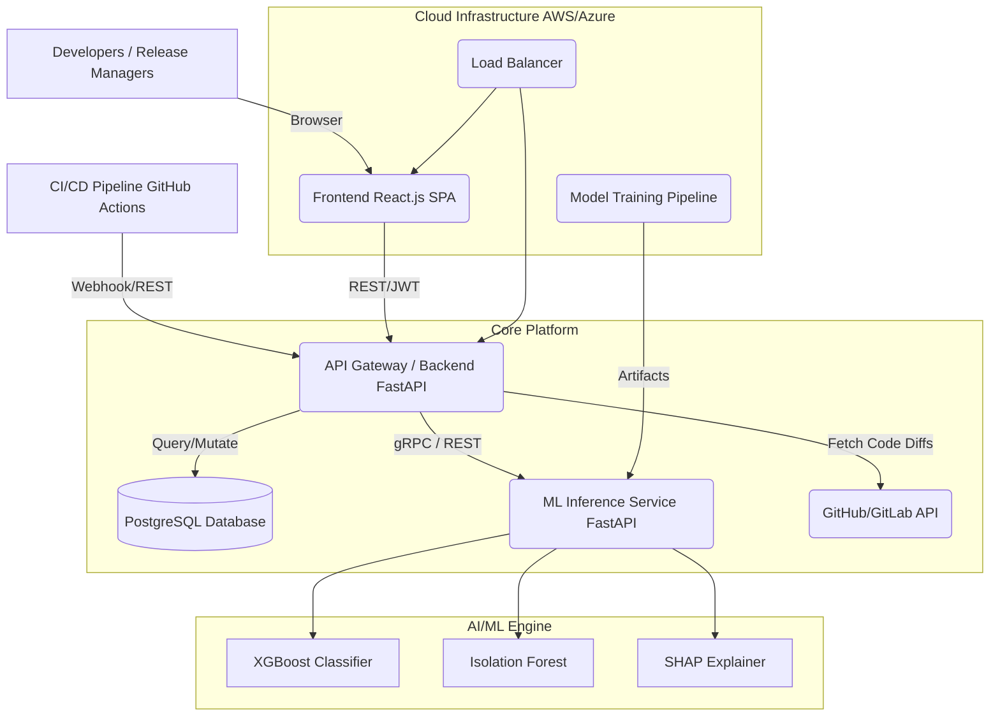

# System Architecture: AI-Based Deployment Risk Prediction Platform

## 1. High-Level Architecture Overview

The system is designed as a modular, containerized microservices architecture to ensure high availability, scalability, and clear separation of concerns.

### 1.1 Architecture Diagram Description

## 2. Component Layers

### 2.1 Frontend
- **Technology**: React.js with Vite, utilizing modern Hooks and Context API.
- **Responsibility**: Provides the "Deployment Risk Dashboard" for Release Managers to monitor incoming deployments, view risk scores (Low/Med/High), read SHAP explanations, and manually override system decisions.
- **Communication**: Communicates with the Backend via RESTful APIs using JWT for authentication.

### 2.2 Backend
- **Technology**: Python with FastAPI (or Node.js with Express).
- **Responsibility**: Acts as the API Gateway. It orchestrates the application logic, communicates with external version control systems (like GitHub API) to gather code change metrics, evaluates ML predictions against a configurable Rules Engine, and manages data persistence.
- **Communication**: Exposes REST endpoints to the Frontend and CI/CD pipelines.

### 2.3 Database
- **Technology**: PostgreSQL (Relational).
- **Responsibility**: Persists structured data, including deployment records, historical risk scores, user accounts, and system configuration (Rules Engine thresholds).
- **Why PostgreSQL?**: Ensures ACID compliance, which is critical for deployment logs and audit trails.

### 2.4 AI/ML Engine
- **Technology**: Python, XGBoost, Scikit-Learn (Isolation Forest), SHAP.
- **Responsibility**: A dedicated, headless microservice that receives feature vectors (lines of code, complexity, developer experience) and returns a quantitative risk score, an anomaly flag, and explainability metrics.
- **Why XGBoost?**: Provides state-of-the-art performance for tabular data classification and seamlessly integrates with SHAP for human-readable reasoning.

### 2.5 CI/CD Integration Layer
- **Responsibility**: Scripts or webhooks (e.g., GitHub Actions, Jenkins) that act as clients to the Backend API. Before a deployment phase, the pipeline requests a risk assessment. If the backend returns a "High Risk" or requires "Senior Review," the pipeline halts and fails the step automatically.

### 2.6 Cloud Deployment Layer & Monitoring
- **Technology**: Docker, Kubernetes (EKS on AWS or AKS on Azure), Prometheus, Grafana.
- **Responsibility**: Manages the orchestration and scaling of the microservices.
- **Monitoring**: Real-time tracking of API latencies, error rates, and ML model drift (accuracy decay over time).

---

## 3. Workflow & Interactions

### 3.1 Data Flow & Prediction Workflow
1. **Trigger**: A deployment is initiated in the CI/CD pipeline.
2. **Data Collection**: The pipeline sends the commit hash and author details to the Backend.
3. **Enrichment**: The Backend calls the GitHub API to fetch lines added/deleted, files changed, and code complexity.
4. **Inference**: The Backend packages this data into a feature vector and sends a synchronous HTTP request to the ML Engine.
5. **Prediction**: The ML Engine runs the data through XGBoost (for risk score) and Isolation Forest (for anomaly detection). It generates SHAP values to explain the prediction.
6. **Rule Evaluation**: The Backend takes the ML risk score and evaluates it against the active rules configuration (e.g., Score > 75 = High Risk = Requires Senior Staff Approval).
7. **Response**: The Backend saves the transaction in PostgreSQL and responds to the CI/CD pipeline to either block or allow the deployment.

### 3.2 Model Training Pipeline
1. **Data Ingestion**: Historical deployment data (successes, failures, code metrics) is dumped from the Database into an Object Store (Amazon S3 / Azure Blob).
2. **Preprocessing & Training**: A scheduled job (e.g., Airflow or AWS SageMaker) pulls the dataset, handles missing values, and trains a new XGBoost model.
3. **Evaluation**: The new model is tested against a holdout dataset. If accuracy exceeds the current production model, it is serialized (e.g., `risk_model.pkl`).
4. **Deployment**: The new `.pkl` artifact is pushed to the ML Engine container via a rolling update, ensuring zero downtime.

### 3.3 Security Architecture
- **Authentication**: All endpoints (except webhooks) require short-lived JSON Web Tokens (JWT) distributed upon login.
- **Authorization**: Role-Based Access Control (RBAC) ensures only `Admins` can adjust risk thresholds, while `Developers` have read-only access.
- **Network Security**: The ML Engine and Database are deployed in private subnets, completely inaccessible from the public internet. Only the Backend (via Load Balancer) can route traffic to them.
- **Data Security**: Secrets (Database passwords, GitHub Tokens) are injected at runtime via Cloud Secret Managers (AWS Secrets Manager / Azure Key Vault). No source code is stored on the platform, preventing IP leakage.
